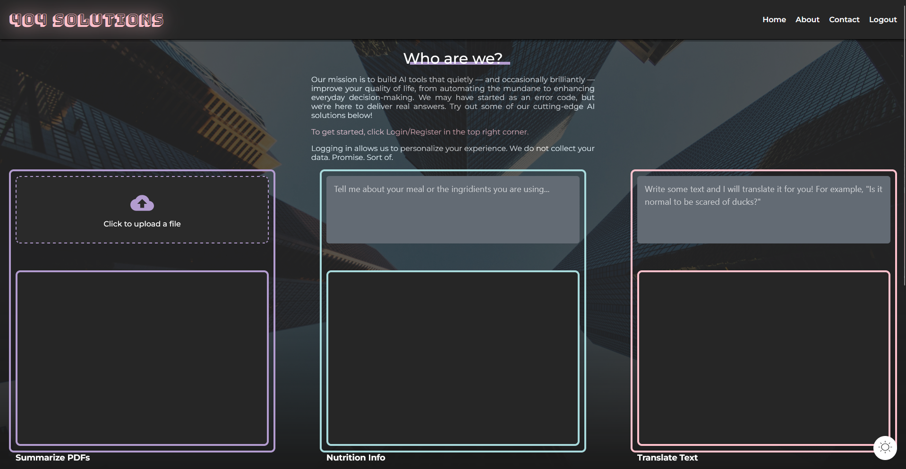

# 🧠 NeoTalent AI Services Portal

A one-page full-stack AI-powered web application that provides intelligent tools to enhance everyday tasks — including:

- 📄 **PDF Summarization**
- 🍽️ **Calorie Estimation**
- 🌐 **Text Translation**

> This app is built as a showcase of integrating AI services in a user-friendly, secure, and scalable architecture using modern full-stack tooling.

---

## ✨ Features

### 📄 1. PDF Summarization
Users can upload a PDF, which is parsed into text and sent to an LLM for summarization. The response is:
- Streamed live to the UI (simulating real-time generation)
- Saved to the database under the logged-in user
- Searchable through a summary history panel




---

### 🍽️ 2. Calorie Estimation
Takes free-form text (e.g., "3 eggs and 2 slices of toast") and estimates:
- Total calories
- Breakdown per ingredient
- Simple dietary insight from the LLM


---

### 🌐 3. Text Translation
Users can input any text and:
- Auto-detect the original language (or specify it)
- Choose a target language
- Get a fast and contextual translation powered by an LLM

---

## 🛠️ Tech Stack

| Layer      | Tools Used                                   |
|------------|----------------------------------------------|
| Frontend   | React (SCSS modules, MUI components)         |
| Backend    | FastAPI (Python)                             |
| AI         | OpenAI API (via `gpt-3.5/4`)    |
| Auth + DB  | PocketBase (embedded DB + auth provider)     |
| DevOps     | Docker + Docker Compose                      |

---

## 🚀 Running the App with Docker

Make sure you have Docker Desktop installed and running.

### 🔧 Project Structure:
```text
📦 NeoTalent-Assignment/
├── neotalentfrontend/          # React frontend (UI, SCSS, MUI)
│   ├── public/
│   ├── src/
│   ├── Dockerfile
│   └── package.json
│
├── neotalentbackend/           # FastAPI backend (AI endpoints, auth, routing)
│   ├── routes/
│   ├── services/
│   ├── schemas/
│   ├── core/
│   ├── Dockerfile
│   └── main.py
│
├── pocketbase/                 # PocketBase DB and auth server
│   ├── pocketbase              # Linux binary (executable, no .exe)
│   ├── pb_data/                # Auto-generated database and uploads
│   └── Dockerfile
│
├── docker-compose.yml          # Orchestrates all 3 services
├── .env                        # PocketBase admin credentials
├── .gitignore                  # pb_data/, node_modules/, env files, etc.
└── README.md                   # Full documentation (you’re writing this!)
```


### ✅ Environment Setup (`.env` in root)

```env
REACT_APP_POCKETBASE_EMAIL=admin@example.com
REACT_APP_POCKETBASE_PASSWORD=supersecurepassword
REACT_APP_POCKETBASE_EP=http://127.0.0.1:8090
```

### 🧪 Build & Run the App:

`docker-compose up --build`

Then access:

    Frontend: http://localhost:3000

    Backend API: http://localhost:8000

    PocketBase Admin: http://localhost:8090